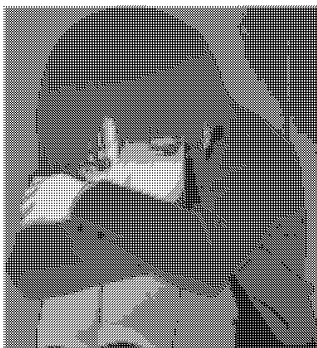

# ditherify
a basic dithering utility

# Dependencies
- python3
- pillow
- numpy

## Intall dependencies
```shell
pip3 install pillow
pip3 install numpy
```

# Usage
```
Usage:
python dithering.py <input_image_path> <sub_pixel_size> [--invert] [--normalize]
                    [--exposure <exposure>] [--nb-colors <nb_colors>] [...]

Mandatory arguments:
  <input_image_path>: path to input image
  <sub_pixel_size>: integer greater than 2 representing the size of a patch of pixel to dither

Options:
  --invert: inverse the original image

  --normalize: normalize the input image (the brightest pixel will be white and the darkest black)
  --expossure <expossure>: float the sensitivity to brightness (between 0.1 and 10, default = 2)
  --nb-colors <nb_colors>: int greater than 1 and less than 256, the size of the colorspace before dithering (2 = black and whithe, 3 = black, gray, white etc...) (default = 3)
  --rgb-correction <float> <float> <float>: correction factor for RGB components

  --colored: set the output as colored (default is black and white)


  -h, --help: display this message
```

# Examples
## black and white with no grey


## 8 shades of grey


## rgb


## color corrected

